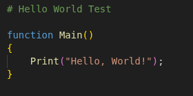
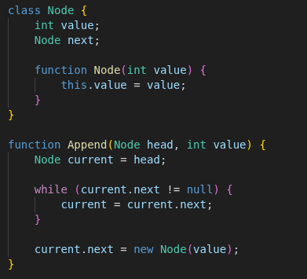

# Raze Language Support
> If you're looking for the Raze compiler, please refer to the [Raze compiler GitHub page](https://github.com/Ezlanding1/Raze/) 

This project contains a tmLanguage grammar which is used to provide syntax highlighting for the Raze programming language. Download the Raze Language Support extension from the [VScode Marketplace](https://marketplace.visualstudio.com/vscode). Alternatively, you can manually install the extension by placing the `raze-language-support` directory within your vscode extensions folder (`~/.vscode/extensions`).

## Samples

### Hello, World!

### Linked List

